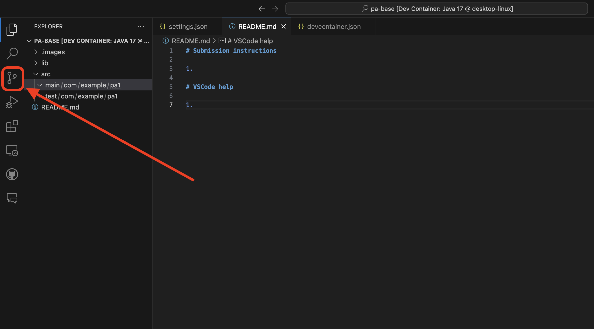
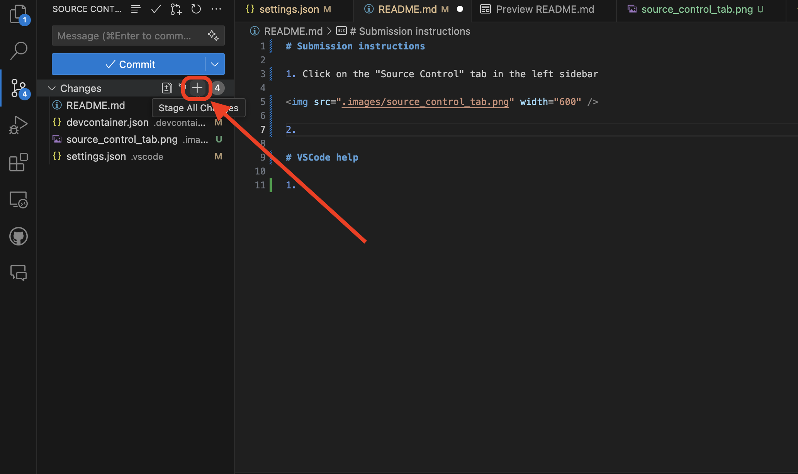
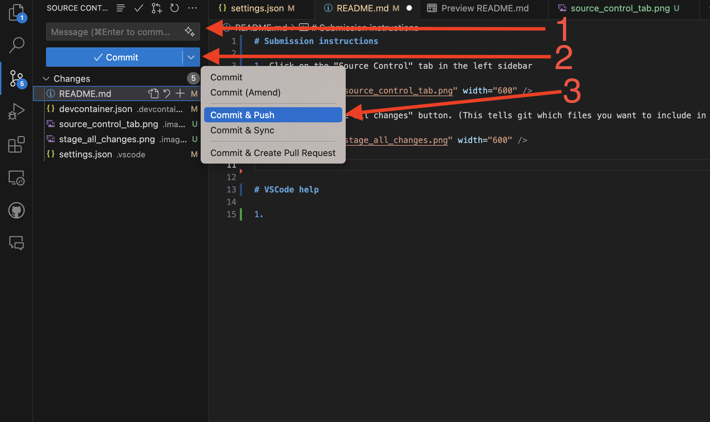

# HW3: Trying out Libraries

In this homework, you will be using four different methods for generating a visualization of the same data.  The goal of this assignment is for you to be exposed to a variety of visualization libraries and understand the strengths and weaknesses between them.  

You will use multiple python libraries to try to recreate the same chart type, with some small modifications.  You will be asked to read the documentation for the libraries we are using, and you will be graded based on your ability to find the right configuration options to complete various modifications of the chart.

## Dataset: Video Game Sales

In this homework, we are working with a dataset showing Video Game sales.  We will be building a chart that analyzes the relationship between US Domestic and foreign sales, along with some ancillary variables like developer, country of origin, year, and system.  

The dataset was gathered from a [kaggle.com competition](https://www.kaggle.com/datasets/gregorut/videogamesales).

## Running the notebook

Development for this assignment is done inside of a [Jupyter Notebook](https://jupyter.org/), a common tool for iterative data science work.  There are several ways that you can run this notebook and develop your homework.  Notebooks like this are composed of a sequence of "cells", with each cell containing some snippets of code or some descriptive, README-like text.  When you run a cell in your notebook, it saves the result of that cell in memory.  To run a cell, you can either click the little "play" button on the top right corner of a cell, or you can use Shift+Enter to run the current cell.

Note that these python cells run against a python server, different than the web server we have been using in class.  There are two methods you can use to run your notebook server.

### Method 1: Github codespaces

The first and easiest way to run the notebook in this assignment is to run it in [Github Codespaces](https://github.com/features/codespaces), a cloud-based development environment that runs in a browser.  We have configured this assignment to include a codespaces editor, and you should be able to open it up just by clicking on the codespaces button in your README when viewing your created repository on github.com.  If that doesn't work, you can also open a codespace by clicking the green Code button, where you usually go to find your github `.git` URL, and click under Codespaces, and create a new Codespace for that repository.

There are 2 important things to note when using github codespaces.

1. When you run the python notebook for the first time, you will have to select what jupyter server to run against.  You want to select the local version of python we have running in the codespaces.  See the screenshot below.  **dylan - put screenshot of selecting python here**
2. When you are using codespaces, your code won't actually get pushed to us automatically.  Like with your earlier HW 1, you will have to create a git commit and push it.  From codespaces, you do this in the following way. 

Expand to see instructions

1. Click on the "Source Control" tab in the left sidebar

2. Click the "Stage all changes" button. (This tells git which files you want to include in the next commit.)

3. Enter a "commit message". Normally this message would describe the changes you made to the code, but for our projects you can enter anything (but it can't be empty).   **You need to remember to make a commit message!**  If you click the commit button without creating a commit message, it will open a file called something like EDIT_MSG, and it will not push your code and may cause your VS Code to freeze until you close the EDIT_MSG tab.  

Then, click the dropdown on the "Commit" button and select "Commit & Push".

 

### Method 2: Running locally against your own Jupyter installation

If you are comfortable using jupyter on your own, or managing your own python environment, you can run jupyter yourself in a terminal on your machine.  You can follow the instructions here to figure out how to install jupyter, and then run `jupyter notebook` in your terminal.  Note that there is a `requirements.txt` file that says what python packages you need to install for this assignment.  Again, remember to commit and push your changes.

If you use your own machine to work on your notebook, you should then be creating your own git commit and pushing it using the terminal, like you did with HW 1.  This typically means first saving your work, then in your file explorer, finding the folder you have been working in, right clicking and opening the terminal or gitbash there, and then running your git commands:

    git add .
    git commit -m "MY COMMIT MESSAGE HERE"
    git push

Then, you should go to your repository page on github.com to confirm that it pushed.

When you are finished, make sure that your commits have gone through.  If you have any issues, please go to a TA.  Lastly, **remember to submit the link to your URL on the Moodle assignment**.
